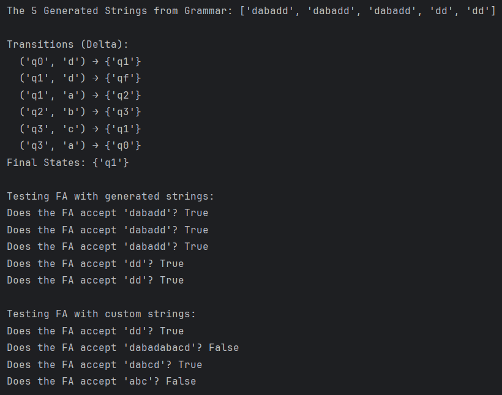
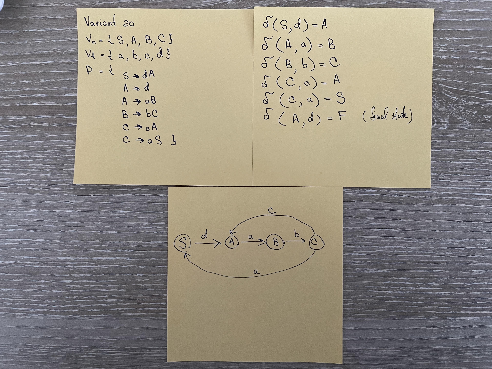

# Regular Grammar

### Course: Formal Languages & Finite Automata
### Author: PATRICIA MORARU, FAF-233

----

# Theory

A **formal language** is a set of strings formed using a predefined alphabet and following specific syntactic and semantic rules. It is defined by:

- **Syntax**: Defines which symbols can be used and how they are combined.
- **Semantics**: Defines the meaning of correctly formed expressions.

### Examples
- **Programming languages** (e.g., Python, C++) follow strict formal rules.
- **Mathematical expressions** use a formal syntax (e.g., algebraic expressions).
- **Regular languages**, which are recognized by finite automata, form an important subset of formal languages.

A **regular grammar** is a formal grammar that generates a regular language. It has the following characteristics:

- Productions follow the form:
  - \( A \to aB \) (non-terminal **A** produces terminal **a** followed by non-terminal **B**)
  - \( A \to a \) (non-terminal **A** produces terminal **a** and stops)
- It can be **right-linear** (as used in this experiment) or **left-linear**.

A **finite automaton (FA)** is a mathematical model of computation that recognizes regular languages. It consists of:

1. **States**: Finite set of states **Q** (e.g., \\{q₀, q₁, q₂, q₃\\})
2. **Alphabet**: A finite set of input symbols **Σ** (e.g., \\{a, b, c, d\\})
3. **Transition function δ**: Defines state transitions based on input symbols.
4. **Start state q₀**: The initial state.
5. **Final states F**: States where the FA accepts a string.

---

# Objectives

1. **Understand the concept of formal languages**, including their syntax and semantics, and the criteria that distinguish a formal language from an informal one.
2. **Establish the initial setup** for an evolving project that will be developed throughout the semester. This includes:
   - (a) Setting up a **GitHub repository** to manage and store project updates.
   - (b) Selecting an **appropriate programming language** that allows efficient problem-solving with minimal setup overhead.
   - (c) Organizing **reports in a structured manner** to facilitate easy verification and evaluation.
3. **Work with a given regular grammar**, based on the assigned variant number, and perform the following tasks:
   - (a) **Implement a class** to represent the grammar, encapsulating its components (*non-terminals, terminals, production rules, and start symbol*).
   - (b) **Develop a function** that generates exactly **5 valid strings** from the language defined by the grammar.
   - (c) **Implement a conversion mechanism** that transforms a **Grammar object** into a **Finite Automaton (FA)**, preserving the rules of the original language.
   - (d) **Extend the FA** with a method that verifies whether a given input string **belongs to the language** recognized by the automaton, ensuring it adheres to the defined state transitions.


# Implementation Description

## 1. Grammar Class

The `Grammar` class represents a formal grammar, encapsulating:

- **Non-terminals (V_n)** – symbols that can be replaced.
- **Terminals (V_t)** – symbols that form valid words.
- **Production rules (P)** – transformation rules.
- **Start symbol (S)** – the initial non-terminal.

```python
class Grammar:
    def __init__(self, V_n, V_t, P, S):
        self.V_n = V_n  # non-terminal symbols
        self.V_t = V_t  # terminal symbols
        self.P = P  # the production rules for transformation
        self.S = S  # the start symbol
```

This class initializes the grammar with its core components, ensuring a structured representation of a formal language.

## 2. Grammar Class

The function generate_strings() generates 5 valid strings based on the grammar's production rules.

```python
def generate_strings(self, num_strings=5, max_conv=10):
    gen_str = []

    while len(gen_str) < num_strings:
        new_string = self.S
        steps = 0

        while any(symbol in self.V_n for symbol in new_string) and steps < max_conv:
            for i, symbol in enumerate(new_string):
                if symbol in self.V_n:
                    replacements = self.P[symbol]
                    corresponding_replacement = random.choice(replacements)

                    # replaces non-terminal symbol at the first occurrence in the string
                    new_string = new_string[:i] + corresponding_replacement + new_string[i + 1:]
                    steps += 1
                    break

        if any(symbol in self.V_n for symbol in new_string):
            continue  # for skiping incomplete strings such as 'dabcabcabcA' since i set a limit of 10 conversions

        gen_str.append(new_string)

    return gen_str
```
This function:
-	Expands the start symbol (S) into valid words.
-	Ensures only terminal symbols remain.
-	Continuously generates until exactly 5 valid strings are obtained

## 3. Converting Grammar to Finite Automaton

The function to_finite_automaton() converts a regular grammar into a finite automaton by:
-	Mapping non-terminals to FA states.
-	Defining state transitions based on production rules.
-	Identifying final states.

```python
def to_finite_automaton(self):
    Q = set()  # the sttates
    Sigma = self.V_t  # input symbols
    Delta = {}  # the transition functions (delta)
    F = set()  # the final states
    state_mapping = {}  # the mapping of non-terminals to FA states

    # for better precaution let's ensure from the beginning that `S` is always `q0`
    state_mapping[self.S] = "q0"
    Q.add("q0")

    # assign states to non-terminals except the 'S'
    state_index = 1
    for vn in sorted(self.V_n):
        if vn == self.S:  # skiping S since we already assigned q0
            continue
        state_mapping[vn] = f"q{state_index}"
        Q.add(state_mapping[vn])
        state_index += 1

    q0 = state_mapping[self.S]

    # now we need to define the transitions(delta) and determine the final states
    for vn, prods in self.P.items():
        current_state = state_mapping[vn]

        for prod in prods:
            first_symbol = prod[0]  # first character in production

            if first_symbol in self.V_t:
                if len(prod) == 1:
                    next_state = "qf"  # it's a final state
                else:
                    next_non_terminal = prod[1:]
                    next_state = state_mapping.get(next_non_terminal, "qf")

                if (current_state, first_symbol) not in Delta:
                    Delta[(current_state, first_symbol)] = set()
                Delta[(current_state, first_symbol)].add(next_state)

    # finding the final states (non-terminals producing only terminals)
    for vn, prods in self.P.items():
        for prod in prods:
            if all(symbol in self.V_t for symbol in prod):  # if the production contains only terminals
                F.add(state_mapping[vn])

    print("\nTransitions (Delta):")
    for key, value in Delta.items():
        print(f"  {key} → {value}")

    print("Final States:", F)

    return FiniteAutomaton(Q, Sigma, Delta, q0, F)
```
## 4. FiniteAutomaton Class

The FiniteAutomaton class represents a deterministic finite automaton (DFA) or a non-deterministic finite automaton (NFA) derived from the given regular grammar.

```python
class FiniteAutomaton:
    def __init__(self, Q, Sigma, Delta, q0, F):
        self.Q = Q
        self.Sigma = Sigma
        self.Delta = Delta
        self.q0 = q0
        self.F = F
```
## 5. Checking if a String Belongs to the FA
The function string_belong_to_language() verifies if a given string is accepted by the FA.


```python
def string_belong_to_language(self, str_input):
    state_current = {self.q0}  # tracking also for the case of multiple states like in NFA

    for k in str_input:
        next_state = set()
        for state in state_current:
            if (state, k) in self.Delta:
                next_state.update(self.Delta[(state, k)])

        if not next_state:
            return False

        state_current = next_state

    # checking if any final state is reached, including 'qf'
    return any(state in self.F or state == 'qf' for state in state_current)
```

## 6. grammar_var20() Function
The grammar_var20() function initializes and returns a predefined regular grammar corresponding to a specific variant.

```python
def grammar_var20():
    V_n = {"S", "A", "B", "C"}
    V_t = {"a", "b", "c", "d"}
    P = {
        "S": ["dA"],
        "A": ["d", "aB"],
        "B": ["bC"],
        "C": ["cA", "aS"]
    }
    S = "S"

    return Grammar(V_n, V_t, P, S)
```
## 7. Running the Program (Main Client)
A Main class serves as the entry point, executing:
1.	Grammar initialization (grammar_var20()).
2.	String generation.
3.	Grammar-to-FA conversion.
4.	Testing FA with different strings.

```python
class Main:
    @staticmethod
    def run():
        # use the predefined grammar in the function grammar_var20
        grammar = grammar_var20()

        # generate valid strings from the grammar
        generated_str = grammar.generate_strings()
        print("The 5 Generated Strings from Grammar:", generated_str)

        # convert Grammar to Finite Automaton
        finite_automaton = grammar.to_finite_automaton()

        # test if FA accepts generated strings
        print("\nTesting FA with generated strings:")
        for test in generated_str:
            is_valid = finite_automaton.string_belong_to_language(test)
            print(f"Does the FA accept '{test}'? {is_valid}")

        # additional tests
        custom_str = ["dd", "dabadabacd", "dabcd", "abc"]
        print("\nTesting FA with custom strings:")
        for test in custom_str:
            is_valid = finite_automaton.string_belong_to_language(test)
            print(f"Does the FA accept '{test}'? {is_valid}")
```

# Conclusions

This laboratory work successfully demonstrated the connection between regular grammars and finite automata, providing a structured approach to formal language processing.

For this laboratory work, Python was chosen as the programming language due to its simplicity, flexibility, and efficiency in handling formal languages, automata theory, and string manipulation.

## Achievements:
- Implemented a `Grammar` class to model a right-linear grammar.
- Created a function to generate 5 valid strings from the language.
- Developed a method to convert the grammar into a finite automaton.
- Implemented string validation to check if the FA accepts or rejects input strings.
- Used a `Main` client class to execute and validate the system.


*Figure 1: Results*



*Figure 2: Manula Converting of Grammar to FA*
