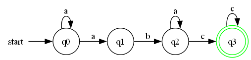
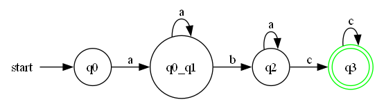
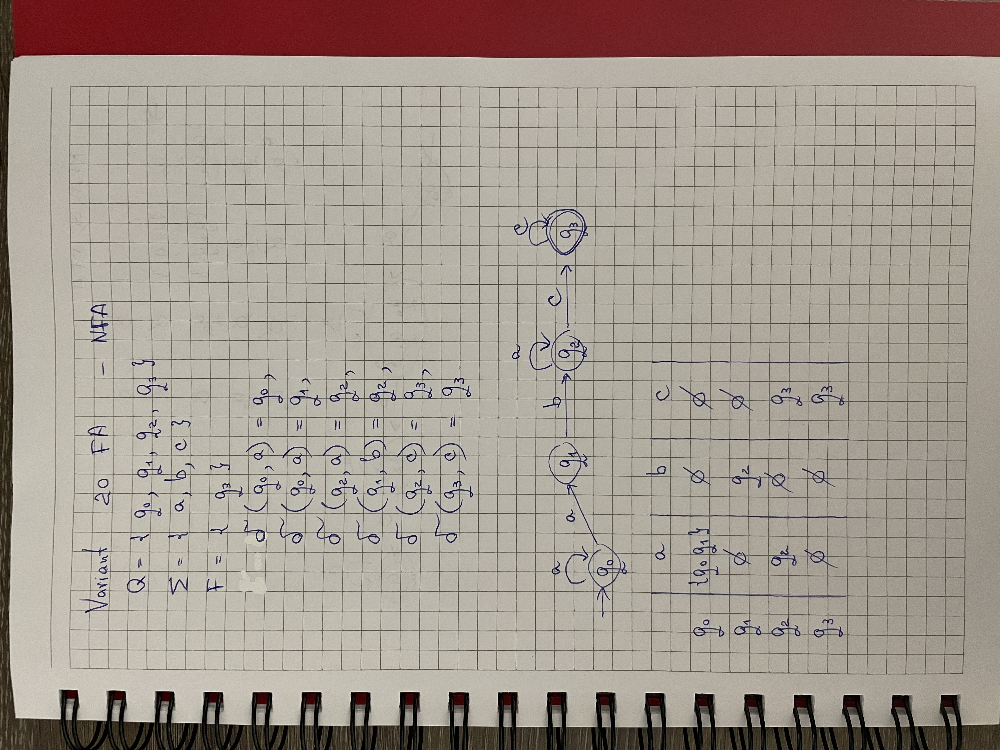
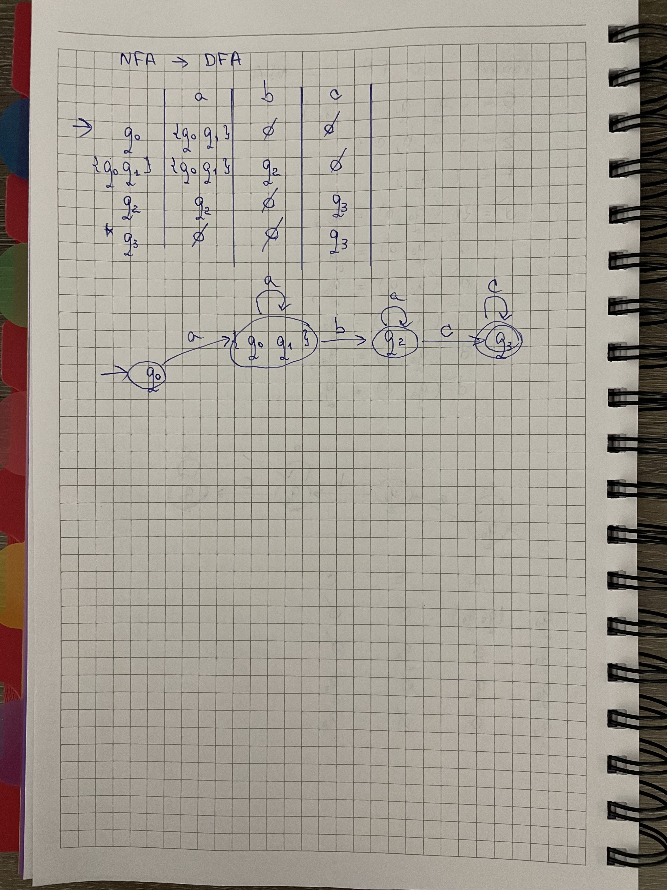

# Report nr.2: Finite Automata

### Course: Formal Languages & Finite Automata
### Author: PATRICIA MORARU, FAF-233

----

# Theory

Finite automata (FA) are abstract mathematical models used to recognize patterns and define computational processes. They are widely applied in text processing, lexical analysis, and control systems. 

A **finite automaton (FA)** consists of:

1. **States**: Finite set of states **Q** (e.g., \{q₀, q₁, q₂, q₃\})
2. **Alphabet**: A finite set of input symbols **Σ** (e.g., \{a, b, c, d\})
3. **Transition function δ**: Defines state transitions based on input symbols.
4. **Start state q₀**: The initial state.
5. **Final states F**: States where the FA accepts a string.

In this work, we implemented various operations related to finite automata, including classifying a grammar based on the Chomsky hierarchy, converting a finite automaton to a regular grammar, checking if an FA is deterministic, and converting an NDFA into a DFA. Additionally, we visualized the automaton using external tools to validate correctness.


---

# Objectives

* Classify a given grammar based on the Chomsky hierarchy.
* Convert a finite automaton to a regular grammar.
* Determine whether the given finite automaton is deterministic (DFA) or non-deterministic (NDFA).
* Implement a function to convert an NDFA to a DFA using the subset construction method.
* Generate a visual representation of the finite automaton.


# Implementation Description

## **1. Grammar Classification**

The implemented function `classify_grammar` within the `Grammar` class determines the classification of a given grammar according to the Chomsky hierarchy. It evaluates whether a grammar falls under one of the following types:

- **Type 3 (Regular Grammar)**: The strictest form, requiring a single non-terminal on the left-hand side (LHS) and a right-hand side (RHS) that follows left-linear or right-linear rules.
- **Type 2 (Context-Free Grammar, CFG)**: Requires a single non-terminal on the LHS and allows more flexible RHS structures (it can contain both left-linear and right-linear combinations).
- **Type 1 (Context-Sensitive Grammar, CSG)**: Ensures that RHS is at least as long as the LHS, preventing shrinking productions.
- **Type 0 (Unrestricted Grammar)**: The most general category, allowing arbitrary productions.

### **Classification Process**
The function initializes boolean flags corresponding to each type of grammar and iterates over the production rules to determine compliance with each classification criterion.

1. **Empty Productions Handling**: The function first checks whether any production rule contains an empty string (`ε`). If the start symbol (`S`) can derive into `ε`, it verifies whether `S` appears in any other rule’s RHS, which is only permitted in certain grammar types.
   
2. **LHS and RHS Analysis**:
   - If the LHS contains more than one symbol, it disqualifies the grammar from being Type 3 (regular) and Type 2 (context-free).
   - If any production results in a RHS that is shorter than the LHS, it invalidates Type 1 (context-sensitive).
   - To classify as Type 3 (regular), RHS must follow strict left-linear or right-linear rules (e.g., a terminal followed by at most one non-terminal).

### **Code Implementation**

```python
    def classify_grammar(self):
        type3_regular = True
        type2_context_free = True
        type1_context_sensitive = True
    
        contains_empty_string = any("ε" in rhs_list for rhs_list in self.P.values())
        start_symbol_derives_into_empty = "ε" in self.P.get(self.S, [])
        start_symbol_appears_rhs = any(self.S in rhs for rhs_list in self.P.values() for rhs in rhs_list)
    
        for lhs, rhs_list in self.P.items():
            if len(lhs) > 1:
                type2_context_free = False
                type3_regular = False
            for rhs in rhs_list:
                if len(rhs) < len(lhs):
                    type1_context_sensitive = False
                if any(sym in self.V_n for sym in rhs):
                    if not (rhs[0] in self.V_t and (len(rhs) == 1 or rhs[1] in self.V_n)):
                        type3_regular = False
```
## **2. Converting FA to Regular Grammar**

The function `convert_fa_to_rg` was implemented in the `FiniteAutomaton` class to transform a given finite automaton (FA) into an equivalent regular grammar (RG). The conversion follows a systematic approach where FA states correspond to non-terminals, the FA alphabet corresponds to terminals, and transition rules are converted into production rules.

### **Conversion Process**
The function performs the following steps:

1. **Defining Grammar Components**:
   - **Non-terminals (`V_n`)**
   - **Terminals (`V_t`)**
   - **Production Rules (`P`)**
   - **Start Symbol (`S`)**

2. **Constructing Production Rules**:
   - Each FA transition of the form `(state, input) → next_state` is transformed into a production rule `state → input next_state`.

3. **Handling Final States**:
   - If an FA final state can terminate, an **ε-production** is added to allow derivation of an empty string.
### **Code Implementation**

```python
def convert_fa_to_rg(self):
    V_n = self.Q  
    V_t = self.Sigma 
    P = {} 
    S = self.q0  

    for state in self.Q:
        P[state] = []

    for (state, symbol), next_states in self.Delta.items():
        for next_state in next_states:
            P[state].append(symbol + next_state)

    for final_state in self.F:
        P[final_state].append("ε")

    return gr.Grammar(V_n, V_t, P, S)
```

## **3. Checking if FA is Deterministic**

The function `is_deterministic` determines whether a given finite automaton (FA) is deterministic or non-deterministic. A **deterministic finite automaton (DFA)** must satisfy two key conditions:

1. **Unique Transitions for Each State-Symbol Pair**:
   - A DFA must have exactly **one transition** for each `(state, symbol)` combination. If a state has multiple transitions for the same input symbol, the FA is considered **non-deterministic (NDFA)**.

2. **Absence of Epsilon (ε) Transitions**:
   - A DFA **cannot** contain ε-transitions (moves that allow a state to change without consuming any input symbol). If such a transition exists, the FA is classified as **non-deterministic**.

### **Code Implementation**

```python
def is_deterministic(self):
    for (state, symbol), next_states in self.Delta.items():
        if len(next_states) > 1:
            return False  
        if symbol == "ε":
            return False  
    return True
```


## **4. Converting NDFA to DFA**

The subset construction method was used to convert a **Non-Deterministic Finite Automaton (NDFA)** into a **Deterministic Finite Automaton (DFA)**. This process involves generating new DFA states based on subsets of existing NDFA states.

### **Conversion Process**
The function follows these key steps:

1. **Initialization**:
   - The DFA starts with the initial state of the NDFA represented as a **set**.
   - A new transition table (`new_delta`) is created.
   - A **mapping of new states** is maintained to ensure consistency.

2. **Processing NDFA Transitions**:
   - For each state-symbol pair, the function determines the set of reachable states.
   - If a new state combination is found, it is added to the DFA.
   - The process continues until all reachable states have been processed.

3. **Final State Determination**:
   - Any DFA state that contains an NDFA final state is marked as a **DFA final state**.

### **Code Implementation**

```python
def convert_ndfa_to_dfa(self, visualize=False):
    new_states = {frozenset([self.q0])}  
    new_delta = {}  
    new_final_states = set()
    unprocessed_states = [frozenset([self.q0])]
    state_name_map = {frozenset([self.q0]): "q0"}  

    while unprocessed_states:
        current_set = unprocessed_states.pop()
        for symbol in self.Sigma:
            next_set = set()
            for state in current_set:
                if (state, symbol) in self.Delta:
                    next_set.update(self.Delta[(state, symbol)])

            if next_set:
                next_set = frozenset(next_set)
                if next_set not in state_name_map:
                    state_name_map[next_set] = "_".join(sorted(next_set))
                    new_states.add(next_set)
                    unprocessed_states.append(next_set)

                new_delta[(state_name_map[current_set], symbol)] = {state_name_map[next_set]}  

    for state_set in new_states:
        if any(s in self.F for s in state_set):
            new_final_states.add(state_name_map[state_set])

    return FiniteAutomaton(set(state_name_map.values()), self.Sigma, new_delta, "q0", new_final_states)
```
## **5. Graphical Representation**

To enhance the understanding of a finite automaton (FA), **Graphviz** is used to generate a visual representation. This visualization helps illustrate the states, transitions, and final states of the FA in a clear and structured manner.

### **Visualization Process**
The function follows these key steps:

1. **Graph Initialization**:
   - A **left-to-right** (`LR`) directed graph is created with **Graphviz**.
   - The states are processed to ensure a **readable format**.

2. **State Representation**:
   - Each state is added as a node.
   - **Final states** are represented using a **double-circle** with a distinct color (bright green in our case).
   - The start state is indicated by a separate entry point.

3. **Transitions**:
   - Edges are added to represent transitions, labeled with the corresponding input symbols.

4. **Rendering the Graph**:
   - The graph is saved as a **PNG file** and displayed.

### **Code Implementation**

```python
def visualize_fa(fa, filename="finite_automaton"):
    dot = graphviz.Digraph(format='png')
    dot.attr(rankdir='LR', size='10')

    for state in fa.Q:
        shape = "doublecircle" if state in fa.F else "circle"
        dot.node(str(state), shape=shape, color="green" if state in fa.F else "black")

    dot.node("start", shape="none", width="0")
    dot.edge("start", str(fa.q0))

    for (state, symbol), next_states in fa.Delta.items():
        for next_state in next_states:
            dot.edge(str(state), str(next_state), label=symbol)

    dot.render(filename, view=True)
    print(f"Finite Automaton graph saved as {filename}.png")
```

# Conclusions

This laboratory work successfully demonstrated the connection between **regular grammars and finite automata**, providing a structured approach to **formal language processing**. 

Through **conversion between finite automata and regular grammars**, we explored the **deterministic and non-deterministic nature of automata** and implemented methods to **convert an NDFA into a DFA** using the **subset construction algorithm**.

Additionally, **graphical representations** of the automata provided a clearer understanding of **state transitions and language acceptance**, confirming the correctness of the transformations.

Python was chosen due to its **efficiency in handling automata operations**, **flexibility in working with sets and dictionaries**, and the availability of **graph visualization libraries** like **Graphviz** for automaton representation.

---

## Achievements:

- **Implemented a `Grammar` class** to represent a **right-linear grammar**.
- **Developed a method** to classify the grammar based on the **Chomsky hierarchy**.
- **Generated valid strings** from the language using **random derivations**.
- **Implemented FA to Regular Grammar conversion**, ensuring correct transition mapping.
- **Created an NDFA to DFA conversion function** using the **subset construction method**.
- **Implemented a check for FA determinism** to distinguish between **DFA and NDFA**.
- **Designed a visualization system** using **Graphviz** to represent FA and DFA structures.
- **Validated string acceptance** to determine whether a given input belongs to the language.

## Results:
### Output from console
```bash
Grammar Classification:
Type 3: Regular Grammar

Grammar converted to Finite Automaton:

Finite Automaton Representation

States (Q): {'q0', 'q2', 'q3', 'q1'}
Alphabet (Σ): {'c', 'a', 'b', 'd'}
Initial State (q0): q0
Final States (F): {'q1'}

Transitions (Delta):
('q0', 'd') -> {'q1'}
('q1', 'd') -> {'qf'}
('q1', 'a') -> {'q2'}
('q2', 'b') -> {'q3'}
('q3', 'c') -> {'q1'}
('q3', 'a') -> {'q0'}

FA Transformation Completed!


Original Finite Automaton:

Finite Automaton Representation

States (Q): {'q0', 'q2', 'q3', 'q1'}
Alphabet (Σ): {'c', 'a', 'b'}
Initial State (q0): q0
Final States (F): {'q3'}

Transitions (Delta):
('q0', 'a') -> {'q0', 'q1'}
('q1', 'b') -> {'q2'}
('q2', 'a') -> {'q2'}
('q2', 'c') -> {'q3'}
('q3', 'c') -> {'q3'}

FA Transformation Completed!


Finite Automaton converted to Regular Grammar:
VN (Non-terminals): {'q0', 'q2', 'q3', 'q1'}
VT (Terminals): {'c', 'a', 'b'}
Start Symbol: q0
Production Rules:
  q0 → aq0 | aq1
  q2 → aq2 | cq3
  q3 → cq3 | ε
  q1 → bq2

FA Deterministic Check:
Non-Deterministic

Converted DFA:

Finite Automaton Representation

States (Q): {'q0', 'q3', 'q0_q1', 'q2'}
Alphabet (Σ): {'c', 'a', 'b'}
Initial State (q0): q0
Final States (F): {'q3'}

Transitions (Delta):
('q0', 'a') -> {'q0_q1'}
('q0_q1', 'a') -> {'q0_q1'}
('q0_q1', 'b') -> {'q2'}
('q2', 'c') -> {'q3'}
('q2', 'a') -> {'q2'}
('q3', 'c') -> {'q3'}

FA Transformation Completed!

Finite Automaton graph saved as finite_automaton.png
Finite Automaton graph saved as converted_dfa.png
```

## Visualization
### NDFA Visualization

The original **Non-Deterministic Finite Automaton (NDFA)**:




---
### DFA Visualization

Here is the **converted DFA**:



## Manual Conversion



