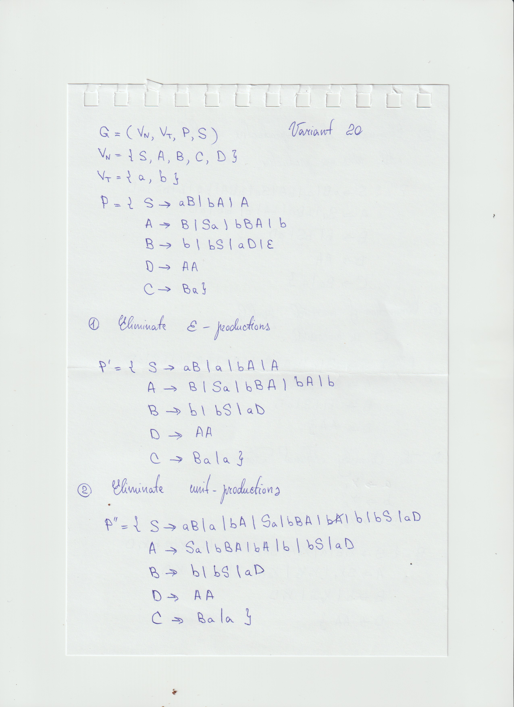

# Report nr.5: Chomsky Normal Form

### Course: Formal Languages & Finite Automata  
### Author: PATRICIA MORARU, FAF-233

---

# Theory

Chomsky Normal Form (CNF) is a standard form of context-free grammars that simplifies parsing and analysis. A grammar is in CNF if all of its production rules are of the following forms:

- A → BC, where A, B, and C are non-terminal symbols, and neither B nor C is the start symbol.
- A → a, where A is a non-terminal and a is a terminal symbol.
- Optionally, the start symbol may produce ε (the empty string), but only in specific cases.

Converting a grammar to CNF involves multiple transformation steps:
1. **Eliminating ε-productions** (productions that produce an empty string).
2. **Eliminating unit productions** (rules where a non-terminal maps directly to another non-terminal).
3. **Eliminating inaccessible symbols** (symbols that are never reached from the start symbol).
4. **Eliminating non-productive symbols** (symbols that do not derive any terminal string).
5. **Converting the remaining rules** into the proper CNF forms.

These transformations ensure the resulting grammar maintains the same language but is restricted to a simpler, more uniform structure that supports efficient parsing algorithms such as CYK.

---

# Objectives

The main goals of this lab work are as follows:

- Understand the concept and definition of Chomsky Normal Form (CNF) [1].
- Study and apply the steps involved in normalizing a grammar into CNF.
- Implement a programmatic solution that takes a grammar and applies all CNF transformation steps.
- Encapsulate the CNF conversion process in a well-structured method and class.
- Execute and test the implemented method on a sample grammar.
- *(Bonus)* Ensure the implementation is generalized to handle any context-free grammar input, not just a predefined one.

---

# Implementation Description

To implement CNF conversion, a `Grammar` class was developed in Python. This class includes methods corresponding to each step of the CNF transformation pipeline. The code is modular, allowing for clarity and easy testing.

The input grammar is defined with:
- A set of non-terminal symbols.
- A set of terminal symbols.
- A start symbol.
- A dictionary of production rules.

The process follows these transformation steps in order:
1. **Eliminate ε-productions**  
2. **Eliminate unit productions**  
3. **Eliminate inaccessible symbols**  
4. **Eliminate non-productive symbols**  
5. **Convert to CNF format**

Each of these steps is implemented as a method inside the `Grammar` class. In the next section, we will detail each rule and show the corresponding function used in the implementation.

## 1. Eliminating ε-Productions

### Description

The first step in converting a grammar into Chomsky Normal Form is to eliminate all **ε-productions** (also known as nullable productions). These are production rules of the form:

A → ε

Where `A` is a non-terminal and `ε` represents the empty string.

#### Why eliminate ε-productions?

Grammars in CNF are not allowed to contain any rule that produces the empty string, except in very specific cases involving the start symbol. Therefore, it is crucial to eliminate these rules while preserving the language generated by the grammar.

#### Strategy

To eliminate ε-productions:
1. **Identify nullable non-terminals**: A non-terminal is nullable if it has a direct production to ε or can derive ε through a sequence of rules.
2. **Generate new productions**: For every rule that contains one or more nullable non-terminals, we create all possible combinations where nullable symbols can be removed (except for the empty case).
3. **Remove the original ε-productions** from the grammar.

This transformation increases the number of production rules but guarantees that the language generated remains the same, minus the direct derivation of the empty string.

This step is implemented in the `eliminate_epsilon()` method of the `Grammar` class. It relies on a helper method `_generate_nullable_variations` to generate the necessary rule combinations when nullable symbols are present.

### Code

```python
def eliminate_epsilon(self):
    nullable = set()
    for nt, rules in self.productions.items():
        for rule in rules:
            if rule == "":
                nullable.add(nt)

    updated = {}
    for nt in self.productions:
        new_rules = set()
        for rule in self.productions[nt]:
            if rule == "":
                continue
            new_rules.add(rule)
            combos = self._generate_nullable_variations(rule, nullable)
            for alt in combos:
                if alt != rule and alt != "":
                    new_rules.add(alt)
        updated[nt] = list(new_rules)

    self.productions = updated
```

## 2. Eliminating Unit Productions

### Description

The second step in converting a grammar to Chomsky Normal Form is to eliminate **unit productions**, which are rules of the form:

A → B


Where both `A` and `B` are non-terminal symbols.

#### Why eliminate unit productions?

Unit productions do not contribute to the derivation of terminal strings directly. Instead, they introduce an extra level of indirection that makes the grammar more complex and harder to parse. Since CNF requires rules to either produce two non-terminals or a single terminal, unit productions must be removed.

#### Strategy

To eliminate unit productions, we:

1. **Construct the unit closure** for each non-terminal:
   - This means we determine all non-terminals `B` that can be reached from `A` through a chain of unit productions.
2. **Add all productions of `B`** (except unit productions) directly to the set of productions for `A`.
3. **Remove all unit productions** from the grammar.

The result is a new grammar in which each non-terminal only produces terminals or combinations of non-terminals—not other non-terminals by themselves.

This transformation is essential to bring the grammar closer to CNF format, and it is implemented in the `eliminate_unit_productions()` method.

### Code

```python
def eliminate_unit_productions(self):
    updated = {nt: set() for nt in self.non_terminals}
    for nt in self.productions:
        updated[nt].update(self.productions[nt])

    for nt in self.non_terminals:
        unit_stack = [nt]
        visited = set()
        while unit_stack:
            current = unit_stack.pop()
            if current in visited:
                continue
            visited.add(current)
            for rule in self.productions.get(current, []):
                if rule in self.non_terminals:
                    unit_stack.append(rule)
                else:
                    updated[nt].add(rule)

    self.productions = {nt: list(rules - self.non_terminals) for nt, rules in updated.items()}
```

## 3. Eliminating Inaccessible Symbols

### Description

The third step in the CNF conversion process is to eliminate **inaccessible symbols** from the grammar. These are non-terminal symbols that **cannot be reached** starting from the start symbol `S`.

#### Why eliminate inaccessible symbols?

Inaccessible symbols do not affect the language generated by the grammar because they are never used in any derivation starting from the start symbol. Keeping them makes the grammar unnecessarily large and more difficult to parse or analyze.

Removing them ensures the grammar is clean and only includes symbols that participate in the generation of strings in the language.

#### Strategy

To eliminate inaccessible symbols:
1. **Start with the start symbol `S`** and add it to the set of reachable symbols.
2. **Iteratively explore productions**, and for each reachable non-terminal, add any new non-terminals found on the right-hand side of its rules.
3. Once no more new non-terminals are discovered, **remove all symbols** and their corresponding productions that are not in the reachable set.

This ensures that only the symbols used in actual derivations remain in the grammar.

This process is implemented in the `eliminate_inaccessible_symbols()` method.

### Code

```python
def eliminate_inaccessible_symbols(self):
    reachable = set()
    to_visit = [self.start_symbol]

    while to_visit:
        current = to_visit.pop()
        if current in reachable:
            continue
        reachable.add(current)
        for rule in self.productions.get(current, []):
            for symbol in rule:
                if symbol in self.non_terminals and symbol not in reachable:
                    to_visit.append(symbol)

    self.non_terminals = self.non_terminals.intersection(reachable)
    self.productions = {nt: rules for nt, rules in self.productions.items() if nt in reachable}
```

## 4. Eliminating Non-Productive Symbols

### Description

The fourth transformation in the Chomsky Normal Form conversion process is to remove **non-productive symbols**—non-terminals that cannot derive any string composed entirely of terminal symbols.

#### Why eliminate non-productive symbols?

Non-productive symbols do not contribute to generating valid strings in the language. Their presence adds noise and makes parsing inefficient. Eliminating them ensures that all parts of the grammar are useful and meaningful.

#### Strategy

To eliminate non-productive symbols:
1. **Initialize an empty set of productive symbols**.
2. **Iteratively analyze the grammar**:
   - If a rule only contains terminals and productive non-terminals, mark the left-hand non-terminal as productive.
   - Repeat this process until no new productive symbols can be identified.
3. **Remove all non-productive non-terminals and their productions** from the grammar.

This step ensures the grammar is reduced to only the portions that can actually produce strings over the terminal alphabet.

This process is implemented in the `eliminate_non_productive_symbols()` method of the `Grammar` class.

### Code

```python
def eliminate_non_productive_symbols(self):
    productive = set()

    changed = True
    while changed:
        changed = False
        for nt in self.non_terminals:
            for rule in self.productions.get(nt, []):
                if all(ch in self.terminals or ch in productive for ch in rule):
                    if nt not in productive:
                        productive.add(nt)
                        changed = True

    self.non_terminals = self.non_terminals.intersection(productive)
    self.productions = {
        nt: [rule for rule in rules if all(ch in self.terminals or ch in productive for ch in rule)]
        for nt, rules in self.productions.items()
        if nt in productive
    }
```

## 5. Converting to CNF Form

### Description

The final step in transforming a grammar into Chomsky Normal Form (CNF) is to restructure all remaining production rules so they strictly follow one of the two allowed forms:

1. **A → a** — where `A` is a non-terminal and `a` is a terminal symbol.
2. **A → BC** — where `A`, `B`, and `C` are non-terminal symbols.

Rules that don’t follow these forms must be rewritten.

#### Why this step is essential?

This normalization is required because CNF has strict structural requirements that are necessary for algorithms like CYK parsing. By limiting the forms of productions, the grammar becomes more predictable and machine-friendly.

#### Strategy

The `to_cnf()` method follows a two-phase approach:

---

**Phase 1: Replace terminals in long productions**  
- Any rule that contains both terminals and multiple symbols (e.g. `A → aBC`) must have the terminals replaced by new non-terminals.  
- For each terminal `a`, a new non-terminal `X` is introduced such that `X → a`.
- The original terminal in the rule is replaced by the corresponding `X`.

**Example:**  
Original: `A → aBC`  
Converted:  
- Introduce `X₁ → a`  
- Update original to `A → X₁BC`

---

**Phase 2: Reduce right-hand sides to binary form**  
- Any rule longer than two symbols (e.g. `A → BCD`) is broken down recursively into binary productions.
- For each pair of consecutive symbols beyond the first, a new non-terminal is created.

**Example:**  
Original: `A → BCD`  
Step 1: Introduce `X₁ → CD`  
Step 2: Update: `A → BX₁`  

This is repeated until all productions are binary or terminal-only.

---

This step is implemented in the `to_cnf()` method.

### Code

```python
def to_cnf(self):
    new_productions = {}
    terminal_map = {}
    counter = 1

    for nt in self.productions:
        new_rules = []
        for rule in self.productions[nt]:
            if len(rule) > 1:
                symbols = []
                for ch in rule:
                    if ch in self.terminals:
                        if ch not in terminal_map:
                            new_nt = f"X_{counter}"
                            counter += 1
                            terminal_map[ch] = new_nt
                        symbols.append(terminal_map[ch])
                    else:
                        symbols.append(ch)
                new_rules.append(symbols)
            else:
                new_rules.append([rule])
        new_productions[nt] = new_rules

    for t, x in terminal_map.items():
        new_productions[x] = [[t]]
        self.non_terminals.add(x)

    updated = {}
    new_counter = counter
    binary_map = {}

    for nt in new_productions:
        updated[nt] = []
        for rule in new_productions[nt]:
            if len(rule) <= 2:
                updated[nt].append("".join(rule))
            else:
                symbols = rule
                left = symbols[0]
                for i in range(1, len(symbols) - 1):
                    pair = symbols[i] + symbols[i + 1]
                    if pair in binary_map:
                        new_nt = binary_map[pair]
                    else:
                        new_nt = f"X_{new_counter}"
                        new_counter += 1
                        binary_map[pair] = new_nt
                        updated[new_nt] = [pair]
                    symbols[i + 1] = new_nt
                updated[nt].append(left + symbols[-1])

    self.productions = updated
```

---

# Results

Below are the outputs at each stage of the CNF transformation process. These were printed using the `print_grammar()` method after each transformation step:

```bash
--- Initial Grammar ---

S → aB | bA | A  
A → B | Sa | bBA | b  
B → b | bS | aD |   
C → Ba  
D → AA


--- After Eliminating ε-productions ---

S → a | A | aB | bA  
A → bA | Sa | B | b | bBA  
B → aD | b | bS  
C → a | Ba  
D → AA


--- After Eliminating Unit Productions ---

S → aB | bA | bS | a | Sa | b | aD | bBA  
A → bA | bS | Sa | b | aD | bBA  
B → aD | b | bS  
C → a | Ba  
D → AA


--- After Eliminating Inaccessible Symbols ---

S → aB | bA | bS | a | Sa | b | aD | bBA  
A → bA | bS | Sa | b | aD | bBA  
B → aD | b | bS  
D → AA


--- After Eliminating Non-Productive Symbols ---

S → aB | bA | bS | a | Sa | b | aD | bBA  
A → bA | bS | Sa | b | aD | bBA  
B → aD | b | bS  
D → AA


--- Final Grammar in CNF ---

S → X_1B | X_2A | X_2S | a | SX_1 | b | X_1D | X_2X_3  
A → X_2A | X_2S | SX_1 | b | X_1D | X_2X_3  
B → X_1D | b | X_2S  
D → AA  
X_1 → a  
X_2 → b  
X_3 → BA
```

---

# Manual Conversion (Screenshots)

Below are two screenshots that demonstrate the **manual step-by-step conversion** of the given grammar into Chomsky Normal Form (CNF). These visual representations are meant to show the theoretical understanding and how the rules were applied manually.

<p align="center">
  
</p>

<p align="center">
  
</p>


---

# Conclusion

In this lab report, we explored the process of converting a context-free grammar into **Chomsky Normal Form (CNF)** through a series of well-defined transformation steps. The following were achieved:

- A clean and structured implementation in Python, encapsulated in a `Grammar` class.
- Each major rule of CNF conversion (ε-productions, unit productions, inaccessible and non-productive symbols, and CNF restructuring) was implemented as a separate method.
- A trace of the grammar's transformation at each step was printed for verification.
- The final CNF grammar preserves the language of the original grammar and adheres to CNF constraints.

This exercise deepened my understanding of grammar normalization and provided practical experience in algorithmic manipulation of formal grammars. The step-by-step transformation and testing confirm the correctness and robustness of the solution.
