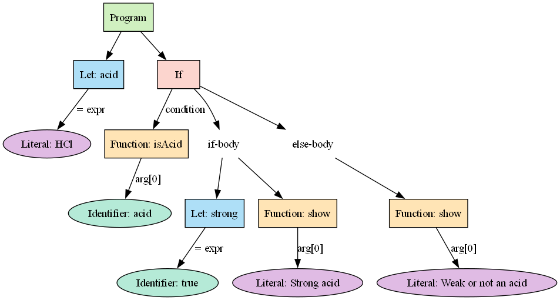

# Report nr.6: Parser & Building an Abstract Syntax Tree

### Course: Formal Languages & Finite Automata  
### Author: PATRICIA MORARU, FAF-233

----

# Theory

In formal language theory and compiler construction, **parsing** is the process of analyzing a sequence of tokens to determine its grammatical structure according to a given formal grammar. After the input text is tokenized by a lexer, the parser checks whether the sequence of tokens conforms to the language’s syntax rules.

A **parser** produces a structural representation of the code — typically in the form of a **Parse Tree** or **Abstract Syntax Tree (AST)**. An **AST** is a simplified, hierarchical tree representation of the syntactic structure of source code. Unlike a full parse tree, the AST omits unnecessary grammar symbols, focusing only on the essential logical structure of the program. Each node in an AST represents a programming construct (like assignments, function calls, conditionals, etc.).

The main goal of building an AST is to enable further processing — such as evaluation, interpretation, code generation, or visualization — by converting the raw tokens into an organized, semantically meaningful format.

In this lab, we extended the lexer from Lab 3 by implementing a **recursive descent parser** that constructs an AST for the ChemOrg DSL language.

---

# Objectives

The objectives of this lab session are:

- Understand what parsing is and how it is programmed in practice.
- Learn the concept and structure of an Abstract Syntax Tree (AST).
- Extend the previously implemented lexer from Lab 3 by adding a parser.
- If not already present, define a `TokenType` (such as an `Enum`) to classify tokens in the lexical analysis phase.
- Use regular expressions to tokenize strings based on the ChemOrg DSL grammar.
- Define appropriate AST node classes to represent DSL constructs such as variable assignments, function calls, and conditional blocks.
- Implement a simple recursive-descent parser to build an AST from tokenized input code.
- Test the parser with various ChemOrg DSL examples and visualize the AST structure.

---

# Implementation Description

The implementation of the parser for ChemOrg DSL was built step by step on top of the existing lexer. The general workflow of the system includes:

1. **Lexical Analysis**: The input string is first tokenized using the `Lexer` class. Tokens are classified into categories such as keywords, identifiers, functions, operators, string literals, and punctuation using the `TokenType` enumeration.

2. **AST Node Definition**: Using object-oriented programming, a class hierarchy was created for different types of AST nodes. These include:
   - `Program`: the root node for the entire script
   - `LetStatement`: for variable declarations and assignments
   - `FunctionCall`: to represent ChemOrg-specific DSL function calls
   - `IfStatement`: to represent control flow logic with `if`, `elif`, and `else`
   - `BinaryOperation`: for expressions involving operators such as `+`, `>`, etc.
   - `Identifier` and `Literal`: for variables and constant values

3. **Parser Implementation**: A recursive-descent parser was developed to convert the list of tokens into a structured AST. It walks through the tokens, identifies patterns (like a `let` assignment or an `if` block), and constructs the appropriate tree node.

4. **AST Visualization**: A GUI interface was added using `Tkinter` that allows users to input ChemOrg code, see the parsed AST in text format, and visualize the tree structure using the Graphviz library. The graphical view helps better understand the syntactic hierarchy of the program.

In the next section, we will walk through the parsing process step by step, breaking down key functions used to analyze input and construct the AST.

## 1. Token Type Enumeration

The first fundamental component of a parser is its ability to correctly recognize and categorize input symbols. In our implementation, this task is handled by a type system called `TokenType`. This type is implemented using Python’s `Enum` class and is used throughout the lexer and parser to classify tokens based on their role in the language grammar.

Each token type represents a category of lexical items in the ChemOrg DSL — for example, keywords like `let`, `if`, and `else`, function identifiers like `show` or `resolve`, operators like `=`, `+`, `>`, punctuation symbols such as `(` and `,`, and so on. During lexical analysis, the lexer assigns a `TokenType` to each token it recognizes. These types are later used by the parser to determine how to interpret the structure of the input.

The purpose of defining `TokenType` as an enumeration is to make the parser more readable, maintainable, and less error-prone. Instead of working with raw strings or integers, we use meaningful labels like `TokenType.KEYWORD` or `TokenType.STRING`, which makes the code more self-explanatory.

The presence of this type also satisfies one of the explicit objectives of this laboratory work, which required a structured categorization system for tokens to guide the syntactic analysis process.

Here is the implementation of the `TokenType` enumeration:

```python
from enum import Enum, auto

class TokenType(Enum):
    KEYWORD = auto()
    FUNCTION = auto()
    IDENTIFIER = auto()
    NUMBER = auto()
    STRING = auto()
    OPERATOR = auto()
    PUNCTUATION = auto()
    BLOCK = auto()
    EXPRESSION_END = auto()
    ERROR = auto()
```

## 2. AST Node Definitions

After lexical analysis, the next important component of the parser is the construction of the **Abstract Syntax Tree (AST)**. The AST is a hierarchical tree structure that represents the syntactic structure of source code in a compact and logical way. Unlike a full parse tree, which includes all the syntactic details of the grammar (including parentheses and non-terminals), an AST only preserves the essential semantic content.

To define the structure of the AST, we created a base class called `ASTNode`, and then several specific node types for various elements of the ChemOrg DSL. Each of these classes inherits from `ASTNode` and implements its own structure and representation logic.

- The `Program` node acts as the root of the AST and holds a list of top-level statements.
- The `LetStatement` node represents variable assignments (e.g., `let x = "H2O"`).
- The `FunctionCall` node represents the invocation of DSL functions like `show(...)`.
- The `IfStatement` node handles `if`, `elif`, and `else` blocks with corresponding conditions and branches.
- The `BinaryOperation` node handles operations like `a + b` or `x > y`.
- The `Identifier` node represents variable names, and the `Literal` node represents constant values such as strings or numbers.

Each node also implements a `__repr__()` method to provide a string representation of the node, and a `pretty()` method to print the AST in a human-readable, indented format. These methods are useful for debugging and displaying the AST in the GUI interface.

The following code shows a subset of the most relevant AST node definitions:

```python
from abc import ABC, abstractmethod

class ASTNode(ABC):
    @abstractmethod
    def __repr__(self):
        pass

class Program(ASTNode):
    def __init__(self, statements):
        self.statements = statements

    def __repr__(self):
        return f"Program({self.statements})"

class LetStatement(ASTNode):
    def __init__(self, identifier, expression):
        self.identifier = identifier
        self.expression = expression

    def __repr__(self):
        return f"Let({self.identifier} = {self.expression})"

class FunctionCall(ASTNode):
    def __init__(self, name, arguments):
        self.name = name
        self.arguments = arguments

    def __repr__(self):
        return f"Call({self.name}({', '.join(map(str, self.arguments))}))"
```

## 3. Main Parser Flow

The core responsibility of the parser is to transform a linear sequence of tokens (produced by the lexer) into a structured representation of the program — the Abstract Syntax Tree (AST). The main entry point of the parser is the `parse()` method, which begins the process by invoking the `parse_statement_list()` method.

The `parse_statement_list()` method reads and collects individual statements one by one until it reaches the end of the input. It ensures that each statement is valid and delegates the actual parsing of specific statements to the `parse_statement()` method.

This flow reflects a **top-down parsing strategy**, also known as **recursive descent parsing**, where the parser is composed of several mutually recursive functions that mirror the grammar rules of the language.

The idea is simple: start from the highest-level rule (`program` → `statementList`) and break it down into lower-level rules by matching expected token patterns and constructing corresponding AST nodes.

Here is the code for the main parsing flow:

```python
def parse(self):
    return Program(self.parse_statement_list())

def parse_statement_list(self):
    statements = []
    while self.peek() and self.peek()["type"] in {
        TokenType.KEYWORD, TokenType.IDENTIFIER, TokenType.FUNCTION
    }:
        statements.append(self.parse_statement())
    return statements
```

## 4. Statement Parsing

The `parse_statement()` function is one of the most important components in the parser, as it determines what kind of statement is currently being read from the token stream. It acts as a decision-making hub that examines the first token of the current statement and routes it to the appropriate parsing function.

Here’s how the logic works:

- If the statement starts with the keyword `let`, it is treated as a **variable declaration or assignment**, and the `parse_assignment()` method is called.
- If it starts with an **identifier**, it is interpreted as a **reassignment** (e.g., `x = ...`), also handled by `parse_assignment()`.
- If it starts with the keyword `if`, it is recognized as a **conditional block**, and the parser invokes `parse_if_statement()`.
- If it starts with a **function name**, it is a **function call**, and the `parse_function_call()` method is called.

After parsing a statement, the parser expects that it will end with an **expression terminator** (`;`). This is checked using the `expect()` method with the `TokenType.EXPRESSION_END`.

This step provides the structural foundation that allows the parser to interpret different kinds of statements in a uniform way, while still delegating specialized parsing logic to dedicated methods.

Here is the implementation of the statement parser:
```python
def parse_statement(self):
    token = self.peek()
    if token["type"] == TokenType.KEYWORD and token["value"] == "let":
        node = self.parse_assignment()
    elif token["type"] == TokenType.IDENTIFIER:
        node = self.parse_assignment()
    elif token["type"] == TokenType.KEYWORD and token["value"] == "if":
        return self.parse_if_statement()
    elif token["type"] == TokenType.FUNCTION:
        node = self.parse_function_call()
    else:
        raise SyntaxError(f"Unexpected statement token: {token}")

    self.expect(TokenType.EXPRESSION_END)
    return node
```

## 5. Parsing Assignments

In the ChemOrg DSL, variable assignments are a fundamental feature, allowing users to store strings, values, or expressions into named identifiers. These assignments can appear in two main forms:

- **With the `let` keyword**: Used to declare a new variable (e.g., `let x = "H2O";`)
- **Without `let`**: Used to reassign or update an existing variable (e.g., `x = "CO2";`)

The `parse_assignment()` function is responsible for handling both cases. Here's how it works:

1. If the parser encounters the `let` keyword, it:
   - Expects an identifier to follow (`let x`)
   - Optionally accepts an `=` followed by an expression
   - If there is no expression, it simply creates a `LetStatement` with `None` as the value

2. If the `let` keyword is **not** present, then:
   - The parser assumes it's a reassignment (`x = ...`)
   - It requires an identifier, an `=`, and an expression

This flexible function allows both declaration and reassignment, producing an AST node of type `LetStatement`, which stores both the variable (`Identifier`) and the right-hand side expression (`Literal`, `FunctionCall`, or `BinaryOperation`).

Here is the implementation of `parse_assignment()`:
```python
def parse_assignment(self):
    if self.match(TokenType.KEYWORD, "let"):
        ident = self.expect(TokenType.IDENTIFIER)
        if self.match(TokenType.OPERATOR, "="):
            expr = self.parse_expression()
            return LetStatement(Identifier(ident["value"]), expr)
        return LetStatement(Identifier(ident["value"]), None)
    else:
        ident = self.expect(TokenType.IDENTIFIER)
        self.expect(TokenType.OPERATOR, "=")
        expr = self.parse_expression()
        return LetStatement(Identifier(ident["value"]), expr)
```

## 6. Expressions & Binary Operations

Expressions are a key part of any language, and in ChemOrg DSL, they can appear in many places — such as the right-hand side of assignments, function arguments, or inside conditional statements like `if (x > 5)`.

The parser handles expressions in a structured, layered way using **operator precedence**. The process follows a top-down strategy where:

- The highest level (`parse_expression`) delegates to `parse_comparison`
- `parse_comparison` checks for comparison operators (`>`, `<`, `==`, etc.)
- If no comparisons are found, it goes deeper to `parse_additive` for handling addition (`+`)
- Finally, `parse_primary` parses the most basic units: literals, identifiers, and function calls

This separation of expression types allows the parser to construct accurate and logically grouped `BinaryOperation` nodes. Each binary operation stores the **left operand**, the **operator**, and the **right operand** as its children.

This structure is essential for later processing or interpretation.

Below is the implementation of `parse_comparison` and `parse_additive`, which form the core of the expression-handling logic:
 
```python
def parse_expression(self):
    return self.parse_comparison()

def parse_comparison(self):
    left = self.parse_additive()
    while self.peek() and self.peek()["type"] == TokenType.OPERATOR and self.peek()["value"] in {"<", "<=", ">", ">=", "==", "!="}:
        op = self.advance()["value"]
        right = self.parse_additive()
        left = BinaryOperation(left, op, right)
    return left

def parse_additive(self):
    left = self.parse_primary()
    while self.peek() and self.peek()["type"] == TokenType.OPERATOR and self.peek()["value"] == "+":
        op = self.advance()["value"]
        right = self.parse_primary()
        left = BinaryOperation(left, op, right)
    return left
```

## 7. Function Call Parsing

Function calls are essential constructs in ChemOrg DSL, allowing users to invoke predefined domain-specific operations such as `show("H2O")`, `resolve("H2+O2")`, or `getMolecWeight("H2O")`.

The `parse_function_call()` method is responsible for handling these function invocations. Here's how it works:

1. It first reads the function name, which must be recognized as a `FUNCTION` token.
2. It expects an opening parenthesis `(` to begin the argument list.
3. Then, it reads one or more arguments. Each argument is a full expression — which means it can be:
   - A literal (like a string)
   - A variable
   - Another function call
   - Even a binary operation (e.g., `a + b`)
4. It separates multiple arguments using commas `,`, and ends when it sees the closing parenthesis `)`.

Each successfully parsed argument is stored in a list, and the final `FunctionCall` AST node holds:
- The function’s name
- The list of arguments as child nodes

This design supports nested function calls and complex input structures, while keeping the logic clean and reusable thanks to its reliance on `parse_expression()`.

Here is the implementation of the function call parser:
```python
def parse_function_call(self):
    func_name = self.advance()["value"]
    self.expect(TokenType.PUNCTUATION, "(")

    args = []
    while not self.match(TokenType.PUNCTUATION, ")"):
        args.append(self.parse_expression())
        if not self.match(TokenType.PUNCTUATION, ","):
            self.expect(TokenType.PUNCTUATION, ")")
            break

    return FunctionCall(func_name, args)
```

## 8. If Statement Parsing

Conditional execution is a crucial part of any programming language, and ChemOrg DSL supports this via the familiar `if`, `elif`, and `else` structure. The parser handles these constructs using the `parse_if_statement()` method, which builds an `IfStatement` AST node containing:

- The **main condition** (an expression inside `if (...)`)
- The **true branch** (a block of statements executed if the condition is true)
- An optional list of **`elif` branches**, each with its own condition and body
- An optional **`else` branch**, executed if none of the previous conditions match

The parsing process works in a nested and layered way:

1. It starts by verifying the `if` keyword and reading the condition inside parentheses `(...)`.
2. It then expects a block `{ ... }`, where the statements to be executed on success are listed.
3. The parser then checks for zero or more `elif` blocks. Each `elif` must include its own condition and block.
4. Finally, it checks for an optional `else` block (no condition required).

Each `if`, `elif`, and `else` body is parsed as a list of statements using `parse_statement_list()`. This makes the conditionals highly flexible and capable of nesting.

Here is the implementation of the `parse_if_statement()` function:
```python
def parse_if_statement(self):
    self.expect(TokenType.KEYWORD, "if")
    self.expect(TokenType.PUNCTUATION, "(")
    condition = self.parse_expression()
    self.expect(TokenType.PUNCTUATION, ")")
    self.expect(TokenType.BLOCK, "{")
    true_branch = self.parse_statement_list()
    self.expect(TokenType.BLOCK, "}")

    elif_branches = []
    while self.match(TokenType.KEYWORD, "elif"):
        self.expect(TokenType.PUNCTUATION, "(")
        elif_cond = self.parse_expression()
        self.expect(TokenType.PUNCTUATION, ")")
        self.expect(TokenType.BLOCK, "{")
        elif_body = self.parse_statement_list()
        self.expect(TokenType.BLOCK, "}")
        elif_branches.append((elif_cond, elif_body))

    else_branch = None
    if self.match(TokenType.KEYWORD, "else"):
        self.expect(TokenType.BLOCK, "{")
        else_branch = self.parse_statement_list()
        self.expect(TokenType.BLOCK, "}")

    return IfStatement(condition, true_branch, elif_branches, else_branch)
```

# Results

To demonstrate the functionality of the parser and AST visualization, we used the following ChemOrg DSL input:

```dsl
let acid = "HCl";
if (isAcid(acid)) {
    let strong = true;
    show("Strong acid");
} else {
    show("Weak or not an acid");
}
```

---

### Token Stream

The lexer produced the following sequence of tokens:

```
KEYWORD: let  
IDENTIFIER: acid  
OPERATOR: =  
STRING: HCl  
EXPRESSION_END: ;  
KEYWORD: if  
PUNCTUATION: (  
FUNCTION: isAcid  
PUNCTUATION: (  
IDENTIFIER: acid  
PUNCTUATION: )  
PUNCTUATION: )  
BLOCK: {  
KEYWORD: let  
IDENTIFIER: strong  
OPERATOR: =  
IDENTIFIER: true  
EXPRESSION_END: ;  
FUNCTION: show  
PUNCTUATION: (  
STRING: Strong acid  
PUNCTUATION: )  
EXPRESSION_END: ;  
BLOCK: }  
KEYWORD: else  
BLOCK: {  
FUNCTION: show  
PUNCTUATION: (  
STRING: Weak or not an acid  
PUNCTUATION: )  
EXPRESSION_END: ;  
BLOCK: }  
```

---

### Parsed Abstract Syntax Tree (AST)

The parser successfully generated the following AST structure:

```
Program([
  Let(Identifier(acid) = Literal(HCl)),
  If(Call(isAcid(Identifier(acid)))) {
    Let(Identifier(strong) = Identifier(true))
    Call(show(Literal(Strong acid)))
  }
  else {
    Call(show(Literal(Weak or not an acid)))
  },
])
```

---

### AST Visualization

The AST can also be visualized as a diagram using Graphviz:



This visual representation helps understand the syntactic hierarchy of the program. Each node corresponds to a meaningful construct, such as a `Let` assignment, `If` condition, or `FunctionCall`, with arrows indicating child relationships.


# Conclusion

In this laboratory work, we successfully designed and implemented a parser for the ChemOrg Domain-Specific Language (DSL). Starting from the tokenized output of the lexer developed in the previous lab, we built a recursive-descent parser capable of analyzing syntactic structures and generating an Abstract Syntax Tree (AST) that represents the logical composition of the input code.

The parser supports core language constructs, including variable declarations and assignments, function calls, and conditional branching with `if`, `elif`, and `else` blocks. Each syntactic element is translated into a corresponding AST node, which provides a clear and structured representation of the program.

To enhance usability and understanding, we also developed a graphical interface using Tkinter, enabling users to:
- Input DSL code
- View the tokenized representation
- Visualize the AST structure using Graphviz

This hands-on experience deepened our understanding of parsing techniques, syntax tree generation, and the internal workings of language interpreters and compilers. The modular design of the parser also lays the groundwork for future enhancements such as semantic analysis, error recovery, and optional parameter support.

Through this lab, we achieved the learning objectives related to parsing theory, AST design, and practical implementation, while reinforcing the connection between theoretical formal grammar and real-world language processing.

